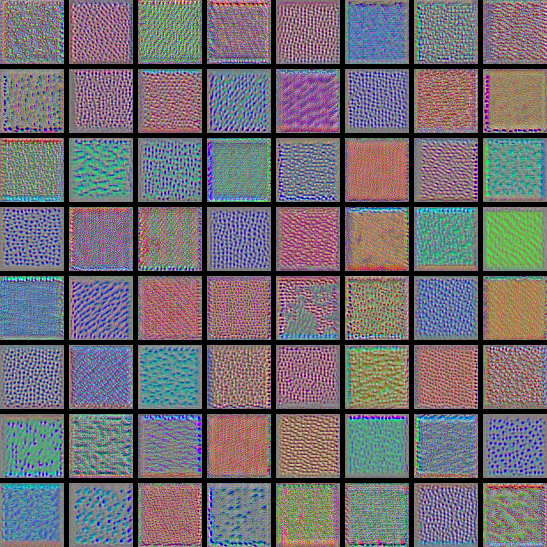
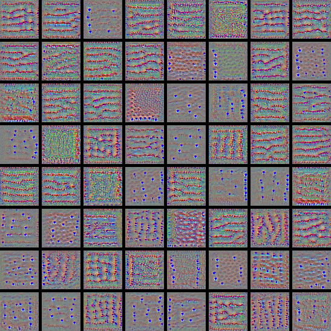
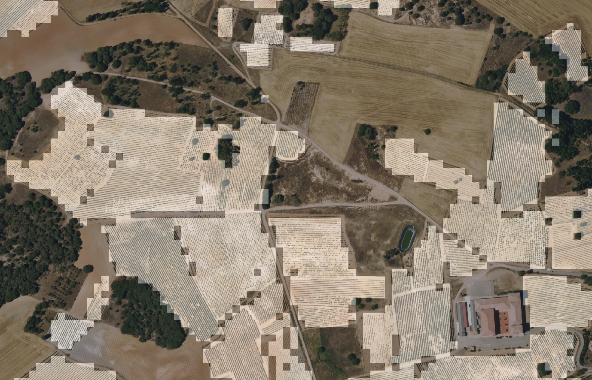
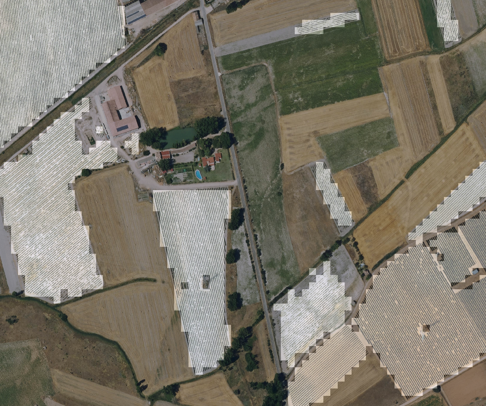
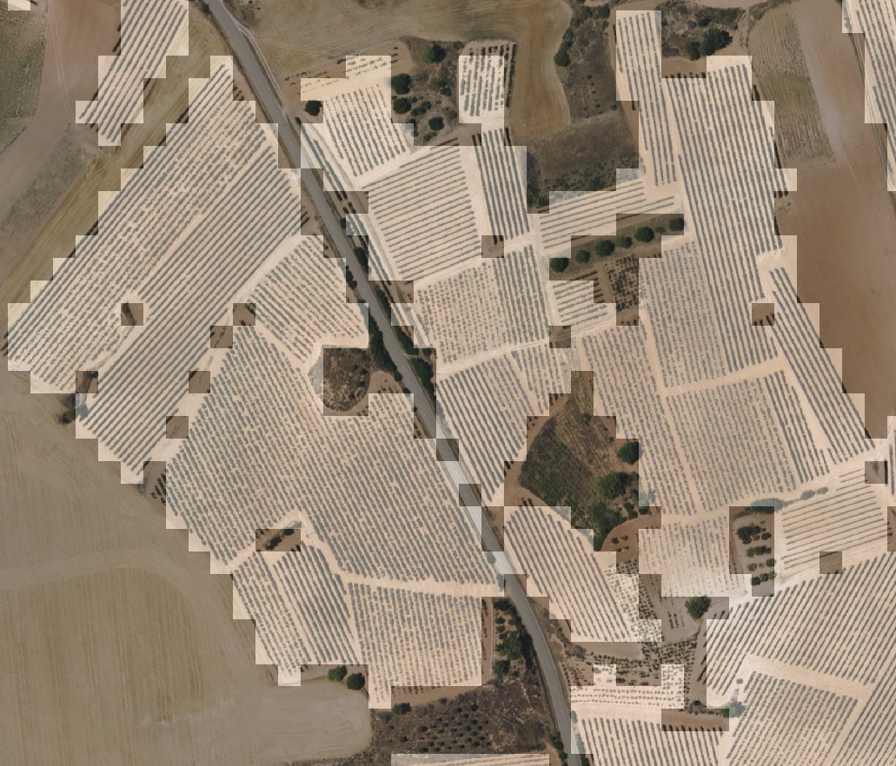

Vineyard detection using high resolution images (25cm/px)
===============================================================

# Objective

Detect vineyard land usage using convolutional network based on aerial images dataset. The objective is to train a
binary classifier that receives as input patches of the images labeled as 0-no vineyard, 1-vineyard and outcomes the
probability of the category 1-vineyard. Once the model is trained, it will be applied to the raster using window sliding
to obtain a mask with the probabilities of vineyard usage in the patch. After this, the masks will be vectorized to
obtain a shapefile, that will be filtered and simplified.

**This is just a prototype.**

# Dataset

* High resolution aerial images (25cm/px) from
  spanish [Plan Nacional de Ortofotografía Aérea (PNOA)](https://pnoa.ign.es/), a restricted área from the region of
  Castilla y León is used in this project to train the classifier. The images for year 2020 in the area of Castilla y
  León can be accessed [here](http://ftp.itacyl.es/cartografia/01_Ortofotografia/2020/).
* LPIS: Land parcel Information System, feature files containing parcels in the area of the images, these features are
  used to manually select the parcels with vineyeard usage to extract patches for each category (0-no vineyard
  1-vineyard). These files can be downloaded for the area of Castilla y León
  from [here](http://ftp.itacyl.es/cartografia/05_SIGPAC/2020_ETRS89/Parcelario_SIGPAC_CyL_Municipios/).

## Data preparation

The dataset will contain samples with RGB 48x48px patches. Steps:

* Select a working area, in this case the Zone of Ribera del Duero, a well known wine production area that extends
  across the provinces of Valladolid, Burgos, Segovia and Soria.
* Download the PNOA images for the working area.
* Manually select samples using QGIS, use the LPIS feature files of the working area.
* For each raster file, filter the geometries contained in it, and use these geometries to cut the raster using the
  LIRs  (Large Interior Rectangles) of each feature. After this step, for each sample feature wi will have a PNG file
  with a rectangle that can be used to extract patches with window sliding technique. LIRs will be separated in
  different folder for positive and negative samples. LIR extraction algorithm is a numba implementation taken
  from https://github.com/lukasalexanderweber/lir.
* Use the LIRs to extract patches using a sliding window of 48x48px and store them in a folder.
* Get 48x48px patches (12x12m), split the dataset in train and validation (0.3 split) and create a numpy array with the
  images to feed the traingin process. The dataset numpy array is stored as a pickle file (dataset.npy).

To run the data set preparation use the python script

``` console
vineyard-detector/vineyard/data/run.py
```

Edit the python code and set these variables:

``` python
    raster_folder = 'Locatio nof your aerial images'
    feature_file = cfg.resource('selectedParcels/selected_parcels.shp')  # features to cut out the rasters and extract lirs and patches.
    dataset_folder = "/media/gus/data/viticola/datasets/dataset_v2"  # destination directory for lirs, patches and dataset.npy
```

In this problem the dataset generated includes

| dataset | no-vineyard | vineyard |
|---------|-------------|----------|
|Train | 2625   |  2590 |
|Test |   1125  | 1110  |

# Model

Train a binary classifier that receives as input patches of the images labeled as 0-no vineyard, 1-vineyard and outcomes
the probability of the category 1-vineyard. The quickest way to implement this model is using transfer learning, take
state of art image recognition models, remove the top layer, freeze the weights of middle layers and train the model
with the problema data. The process has been repeated with different architectures taken
from [keras website](https://keras.io/api/applications/). These models will the base ground before trying to implement
and simpler CNN specific for the problem.

# Training

The model is trained using `ImageDataGenerator` as data input, the generator provides image normalization and image
augmentation to increase the dataset volume and make the model robust against changes in color, brightness, etc. The
ImageDataGenerator provides image augmentation in these parameters: rotation, shift, fliping and brightness, but it
doesn't allow to randonly change the zoom or contrast of the image, so and additional layers is included in the models
to provide changes in the data in these features:

```python
img_augmentation = tf.keras.models.Sequential([
    layers.RandomContrast(factor=0.1),
    layers.RandomZoom(height_factor=(-0.2, 0.2))
], name="img_augmentation")

```

The training process is implemented to allow train different model sequentially and evaluate them against the test
dataset. Each model is trained for up to 200 epochs, using EarlyStopping, ModelCheckpoint and ReduceLROnPlateau tf
callbacks. A folder is created for each model storing:

- Model checkpoint
- History file in joblib format (history.jbl)
- Filter visualizations, if `plot_filters = True`  per each Convolutional layer and image with the first 64 (filter
  visualizations)[https://blog.keras.io/how-convolutional-neural-networks-see-the-world.html].
- Model archicture plot. (model.png)
- A config.json file storing the mean and std per channel used by the  `ImageDataGenerator` to prepare new images for
  prediction.

To run the training process, edit the file to activate train, evaluation, etc. and run:

``` console
vineyard-detector/vineyard/train/run_train.py
```

## Iteration 0, VGG-19 prototype

Using a VGG19 as base model outcomes a validation accuracy around 91%, but running predictions on the raster and
visualizing the results, showed the model has some trouble predicting regular structures that look similar to vineyard
lines, like fruit trees, solar panel installations, some roads and tractor tracks.

So the first effort was made to improve the dataset quality looking for negative samples, visually looking for areas
wrongly predicted by the classifier and extract them using raster extraction tool of QGIS to get pngs copied in
the `/dataset/lirs`
folder to serve as new LIR inputs.

After generating a new dataset version these are the supporting samples for each category are:

| dataset | no-vineyard | vineyard |
|---------|-------------|----------|
|Train | 3779        | 2660     |
|Test | 1621        | 1140     |

## Iteration 1, testing different architectures

After improving the dataset, the VGG-19 model accuracy improved up to 96.1%, the results area consistent with similar
work [1]. In this iteration new base models were tried but with no better results:

- Xception
- ResNet50
- EfficientNetB0

A first attempt of developing a (CNN model)[vineyard/models/cnn.py] is made in this iteration, using a three layer net
with rest addition between layers but with poor results, the validation accuracy didn't take off from 44%. The
architecture of the model was reduced to force overfitting and different tries were made using different in the
activation functions, number of filters, kernel but the accuracy didn't improve.

Trying to train state of the art model from scratch didn't make it better, using VGG-19 or RestNet50 and unfreezing
inner weights before training outcome a similar 43% accuracy. Similar work [3] shows good performance (96-98% accuracy)
of CNN networks in high resolution aerial images with relatively small patches (3x3 to 11x11 px).

## Iteration 2, increase image size

If the state of art architectures as RestNet50 could't make it better that 40%, the hypothesis was that the problem was
in the *receptive field*. Patches of 48x48 could be too small, so deeper architectures can't create good representations
the layer layers.

The receptive field of convNets is amplified as we get deeper in the network architecture, so deeper layers "see" or "
use"
bigger pixel-location information. These architectures are designed to handle 144px images, and changing the input
tensor to only 48px causes filters on certain layers to be limited to 1px, which may explain why deeper layers don't
receive enough information and can't create specific pattern detectors for this problem. Visualizing the filters of the
VGG-19 and RestNet-50 models delivered from scratch, only the first 3-4 layers showed information, the rest were
basically noise.

To check this patch size problem, a resizing layer is included in the model before entering to first convolutional
layer:

```python
    x = tf.keras.layers.Resizing(144, 144)(x)
```

With this the accuracy **boosted over 98%** in the basic CNN model and specific patters appeared in the layer
visualizations:

|model|loss|accuracy|val_loss|val_accuracy|
|-----|------|------|----|----|
|cnnv1|0.011079|0.996549|0.010886|0.997820|
|vgg19|0.748482|0.937569|0.452201|0.961119|
|InceptionV3|0.989122|0.925333|0.687701|0.949128|
|ResNet50|1.107025|0.914196|0.773526|0.943677|
|Xception|1.013036|0.918431|1.034178|0.922965|
|effNet|3.613831|0.698196|1.506067|0.836119|

|  | |:--:| | Layer 5 filter activations|

| | |:--:| | Layer 9 filter activations|

## Iteration 3, increase patch size

As seen in iteration 2, the size of the image significantly affects the performance of the convnet. The resizing layer
added in iteration 2 widens the image to allow deeper layers to have enough activation field to generate patterns, but
it doesn't really increase the information, the patch information is the same. In this iteration we generate a new
dataset taking 64x64px as patch size. This has the drawback of a loss in prediction in the final prediction. Keep in
mind that the objective of this model is to predict areas with vineyards, by expanding the patch from 48px2 to 64px2 we
increase the real prediction area from 12m2 to 16m2, which will lead to less precision in the final segmentation of the
image.

### Final results

Increasing the patch size has improved the performance in a 0.001% - 0.04% depending on the model, so as expected,
increasing the information with the patch size improves the model performance.

| model| loss| accuracy| val_loss| val_accuracy |        |
| -----| ----| --------| -------| ---------- |--------|
| cnnv1| 0.005155| 0.998417| 0.001896| 0.999694 | +0.001 |
| ResNet50| 0.656780| 0.947230| 0.401935| 0.969056 | +0.02  |
| vgg19| 0.654819| 0.941029| 0.403857| 0.964154 | +0.003 |
| Xception| 0.919684| 0.933509| 0.726747| 0.948223 | +0.03  |
| InceptionV3| 1.511058| 0.891029| 1.000285| 0.928002 | +0.006 |
| effNet| 2.469209| 0.801715| 1.608626| 0.874387 | +0.04  |

# Predictions

To apply the model to an input raster file, a non-overlapping sliding window (stride = 48px) is applied to annotate each
48x48px patch with 0 or 1 = vineyard. The resulting single-band raster is normalized to range 0-255 and geo-referenced
using the same SRID of the original imaginary.

To run inference, edit the file `run_inf.py` and set the folder with the input images and the location of your
tensorflow model and run the file:

```python
   models = [
    ['/.../workspace/wml/vineyard-detector/results/iteration3/cnn_64.model', 'vgg19', 1],
]
input_folder = '/.../data/rasters/aerial/pnoa/2020/'
output_folder = '/.../raster/processed'
```

**Some prediction examples**






# Conclusions
This project example is a simple, typical use case of using convolution networks to detect patterns and textures in images.
Most of the complexity of this project is not in the deep-learning part but in the data processing itself: image selection
and location, decision on patch size, extraction of lirs and patches, manual review and filtering, etc.

But this is only the first step of a larger project, the goal is to use this model to deliver a weakly supervised 
semantic segmentation model to automatically draw vineyard plots without using manual annotated samples.

Vineyard plots (usually) have a homogeneous geometric structure that repeats itself. The idea is to use the internal 
weights of the layers of the classifier model obtained in this project, as input features to automatically classify
the parcels in different groups, so two contiguous vineyard plots with different orientation are separated in two groups.

With these annotations we can extract masks automatically to create a dataset that will feed the training process
of the semantic classifier.

# Related work

## Papers

1. Y. Liang, S. T. Monteiro and E. S. Saber, "Transfer learning for high resolution aerial image classification", 2016
   IEEE Applied Imagery Pattern Recognition Workshop (AIPR), 2016, pp. 1-8, doi: 10.1109/AIPR.2016.8010600.
2. Atharva Sharma, Xiuwen Liu, Xiaojun Yang, Di Shi, "A patch-based convolutional neural network for remote sensing
   image classification,"
   Neural Networks, Volume 95, 2017, Pages 19-28, ISSN 0893-6080, https://doi.org/10.1016/j.neunet.2017.07.017.
3. Maher Ibrahim Sameen, Biswajeet Pradhan, Omar Saud Aziz, "Classification of Very High Resolution Aerial Photos Using
   Spectral-Spatial Convolutional Neural Networks", Journal of Sensors, vol. 2018, Article ID 7195432, 12 pages,
   2018. https://doi.org/10.1155/2018/7195432

## Resources

* https://github.com/robmarkcole/satellite-image-deep-learning
* https://paperswithcode.com/sota/image-classification-on-imagenet
* https://blog.tensorflow.org/2020/05/bigtransfer-bit-state-of-art-transfer-learning-computer-vision.html
